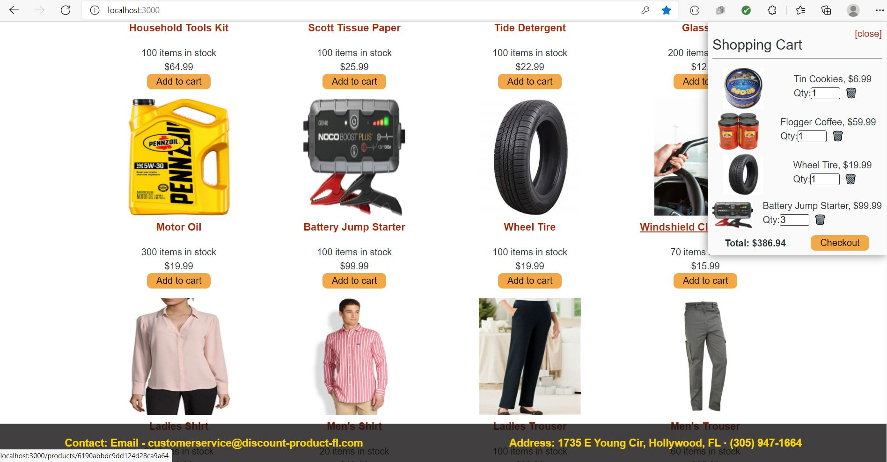
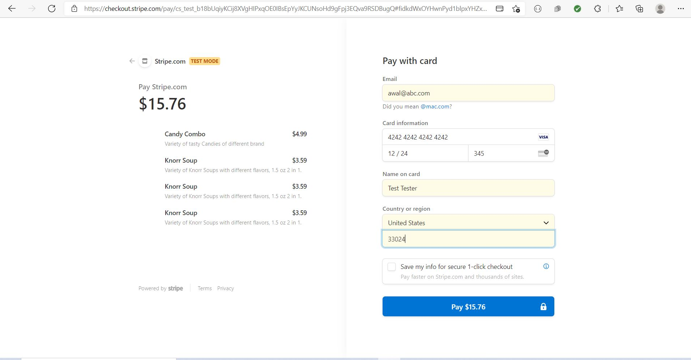
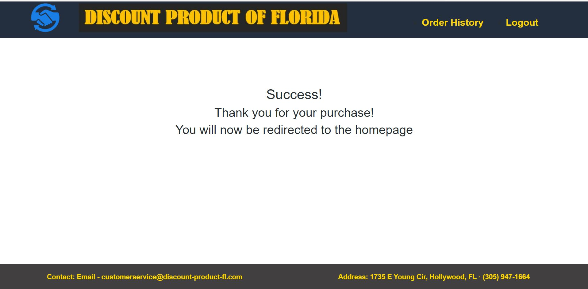
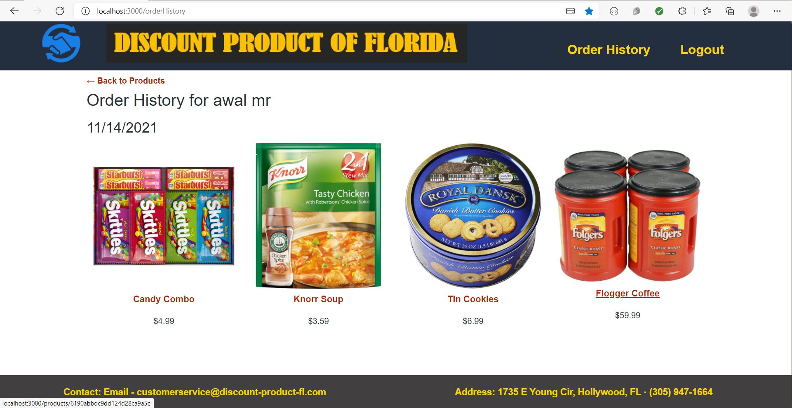

<h1 align="center">REDUX STORE 👋</h1>

## Description

*React Redux is the official UI bindings for react Application. It is kept up-to-date with any API changes to ensure that the React components behave as expected. It encourages good 'React' architecture. It implements many performance optimizations internally, which allows to components re-render only when it actually needs.*


## Table of Contents

- [Description](#description)
- [Table of Contents](#table-of-contents)
- [App Screenshots](#app-screenshots)
- [Overview Links](#overview-links)
- [User Story](#user-story)
- [Acceptance Criteria](#acceptance-criteria)
- [Installation](#installation)
- [Tools](#tools)
- [Usage](#usage)
- [Questions](#questions)


## App Screenshots

- Picture of the Application Home Screen.


- Picture of Application with Cart


- Picture of Payment with Stripe



- Picture of Payment Success Message



- Order History.



## Overview Links
- [Application walkthrough]()

- [Application Deployed in Heroku](https://book-search-engine-mirza.herokuapp.com/)

- [Github link](https://mirzadev.github.io/redux-store/)


## User Story

```text
AS a senior engineer working on an e-commerce platform
I WANT my platform to use Redux to manage global state instead of the Context API
SO THAT my website's state management is taken out of the React ecosystem
```

## Acceptance Criteria

```text
GIVEN an e-commerce platform that uses Redux to manage global state
WHEN I review the app’s store
THEN I find that the app uses a Redux store instead of the Context API
WHEN I review the way the React front end accesses the store
THEN I find that the app uses a Redux provider
WHEN I review the way the app determines changes to its global state
THEN I find that the app passes reducers to a Redux store instead of using the Context API
WHEN I review the way the app extracts state data from the store
THEN I find that the app uses Redux instead of the Context API
WHEN I review the way the app dispatches actions
THEN I find that the app uses Redux instead of the Context API
```

## Installation
💾     
- npm install
- npm install @stripe/stripe-js

## Tools
- NodeJS
- MongoDB
- Mongoose
- Apollo
- React
- Graphql
- Google Book API

## Usage
💻   
  
Run the following command at the terminal:
  
`npm run seed`

`npm run develop`

## Questions
✉️ Contact me with any questions: [email](mailto:awal.mirza2016@gmail.com) , [LinkedIn](https://www.linkedin.com/in/mirza-awal-5972511b5/)